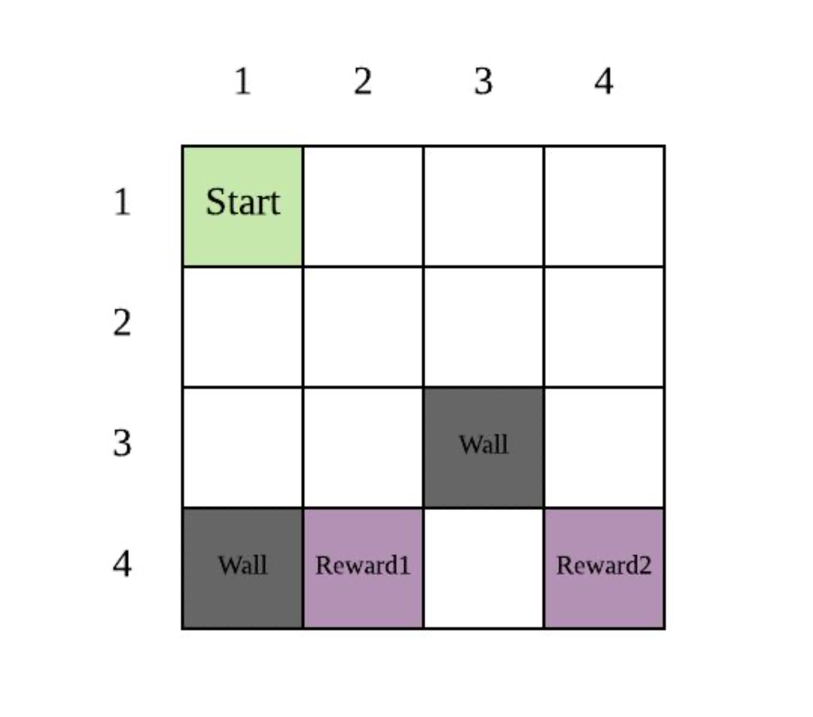
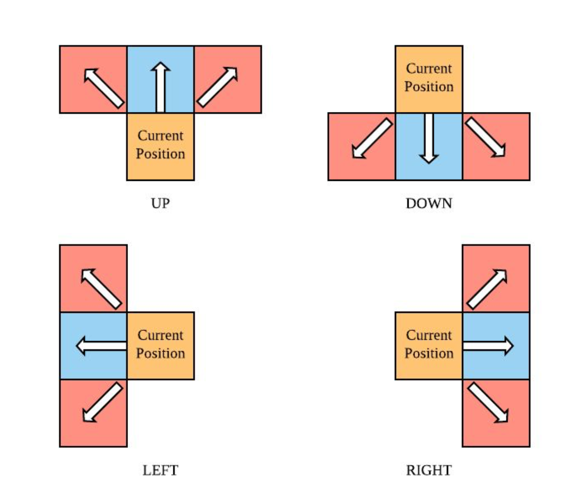
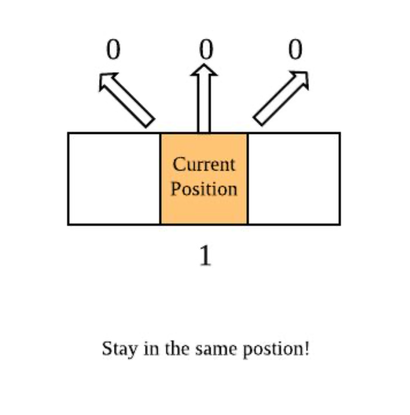
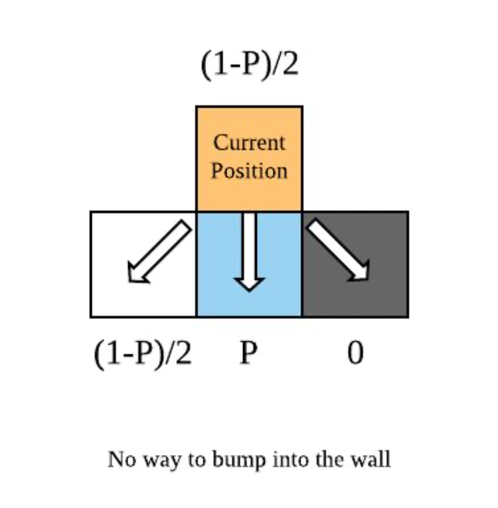

# Advanced-Cash-Miner
An AI Agent trained to play a fictional game Cash Miner, and Collect Maximum Rewards by generating the Most Optimal Control Sequence

# Introduction
“Cash Miner” is a popular flash game on the Internet, in which you control a virtual figure to move in a grid map and finally reach cells containing cash rewards. Recently the video game company “Universe of Soda Consumer” released a new version of the game “Cash Miner” called “Advanced Cash Miner”, in which the virtual figure’s are specified by the player before the game starts. The company also claimed that anyone who can crack the game and give the optimal control sequence to get the maximum expected rewards would receive a huge prize. As an outstanding student in the class of Foundations of Artificial Intelligence, you definitely would not want to miss such a good opportunity to show your ability. Please try to crack the game and win the prize.

# Problem Description
The virtual figure moves in a grid of size N * N, which means there are N * N square cells in the grid. There is a given cell or cells which contain(s) the cash rewards. In addition, there may be some cells containing walls. All other cells in the grid are empty. A typical grid is shown below:

In the above example grid, the virtual figure’s current position is at square (1,1). There are two walls in this grid (squares (3,3) and (4,1)). There are two reward squares in this grid: (4,2) and (4,4).

At each non-reward state, the virtual figure has four possible moves: Up, Down, Left, or Right. At the terminal state, there is only one possible action: Exit.

Unfortunately, the environment in this game is stochastic, because sometimes wind may blow the virtual figure away from its intended direction. Whenever the virtual figure moves in a direction to an empty square, it successfully reaches that square with probability ​P.​ However, there is also a probability of (1 - ​P​)/2 that the figure will be blown off course either 45 degrees clockwise or 45 degrees counter-clockwise.

If the result of an action would move the virtual figure out of the grid, the virtual figure stays in its original cell. In the image below, the virtual figure attempts to move up from the top row in the grid, resulting in it remaining in its current position with probability 1:

If the result of an action would move the virtual figure into a wall cell, the virtual figure also stays in its original cell. In the image below, the virtual figure attempts to move down, but there is a wall in the bottom right square surrounding it. Because there is a probability (1-P)/2 that the wind blows the figure into that wall, there is a (1-P)/2 probability that the figure ends up back in the current position:

On every turn, the virtual figure receives a reward R(s, a). For all non-reward squares, the reward for any movement action is:
R(s) = Rp

When performing the Exit action in a state with reward, Rt , the corresponding reward is:
R(s) = Rt

You are willing to play this game as long as it takes to get your money. On the other hand, you want to receive your money as soon as possible, so money received on your next turn is not always worth as much as money received right now, by a discount factor of 𝛾 (0≤𝛾≤1).

Given a grid, please determine the optimal move sequence for the virtual figure to follow from any square on the grid to maximize your winnings.
